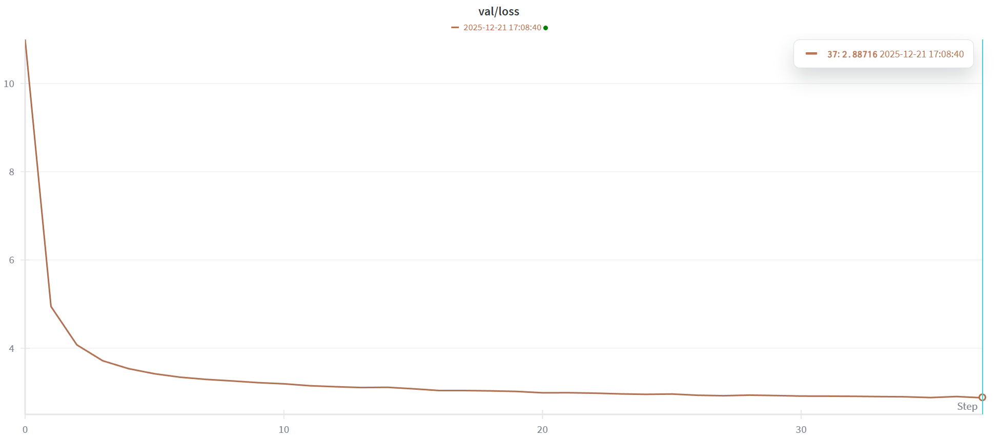
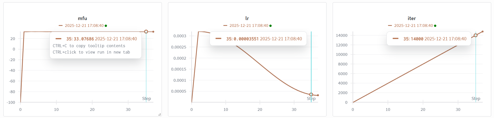

<div align="center">

# EasyGPT
[](https://huggingface.co/siyzhang/EasyGPT) [](https://github.com/ssyzhang/EasyGPT) [](https://github.com/ssyzhang/EasyGPT/blob/main/LICENSE)
</div>

---
基于对karpathy的[nanoGPT](https://github.com/karpathy/nanoGPT?tab=readme-ov-file)项目的学习,加入了自己的理解和一些更新的模块,实现了在单张RTX3090上预训练303m大小的GPT模型(90小时),训练过程中显存占用约为15GB.

### Hardware
- 1X RTX3090

### Model Config
- 采用24层transformer结构,改进了原GPT-2,加入了较新的**RMSNorm,RotaryEmbedding,SwiGLU,GQA**结构,总参数量为303m.
```python
    max_position_embeddings: int = 1024
    vocab_size: int = 50304
    hidden_size: int = 1024
    num_hidden_layers: int = 24
    num_attention_heads: int = 16
    num_key_value_heads:int=4
    head_dim:int=64
    dropout: float = 0.0
    bias: bool = False 
    intermediate_size:int=2560
    norm_eps:float=1e-6
    rope_theta:int=10000
```
### Install
- refer requirements.txt
```bash
pip install -r requirements.txt
```
### Quick Start
```bash
python train.py config/train_gpt.py
```
### Datasets
- [Skylion007/openwebtext](https://huggingface.co/datasets/Skylion007/openwebtext/tree/main)
- 若网速不佳可以考虑使用镜像[hf-mirror](https://hf-mirror.com/)
- 建议先下载至本地再load_dataset
- 可参考如下步骤(支持断点续下载)
```bash
pip install huggingface-hub==0.23.4

export HF_ENDPOINT=https://hf-mirror.com

huggingface-cli download \
  Skylion007/openwebtext \
  --repo-type dataset \
  --resume-download \
  --local-dir openwebtext

python data/prepare.py
```
完成数据集(包含20个tar文件)下载后运行prepare.py即可得到train.bin(17GB)和val.bin,注意磁盘应预留约100GB空间
- 如下载遇困难可通过[百度网盘分享](https://pan.baidu.com/s/1BumYWBCPZiL333kEpr516g?pwd=7xkx)直接下载train.bin和val.bin

### Outcomes
- 每个step为0.5m tokens,共运行15k步(成本有限),耗时90h,也可考虑将模型层数适当改小至12层.
- val loss

- parameters

- outcomes

> It was a historic night at the Bernabéu. In the Champions League semi-final second leg, Real Madrid were losing 0-1 in the 88th minute and were down by two goals on aggregate. Just when everyone thought Man City would easily reach the final, Ancelotti made a final substitution. Ronaldo stood on the sideline, and no one knew what was coming next. He was replaced by a goalkeeper and Ancelotti sent him back into the line-up of players, bringing on the injured Juanfran. Ancelotti’s genius could never get the job done in a competitive fixture but he had a way of ensuring that he didn’t lose another defender. Ronaldo, naturally, will always have a place on the big stage of Spanish football, despite the loss of two of his finest defenders to injury. It seemed impossible that the Portuguese would make it to the semi-finals of the Champions League by winning 1-0 on aggregate, with a goal by Ronaldo equalizing the contest 1-1 with a strike from an otherwise pointless corner. “The biggest thing with Manchester United,” Guardiola would say, was the fact that Ronaldo had put aside everything that made him the biggest player on the planet. “You have to bring somebody else in, or you are not doing the job,” he would insist. “You have to let them have the title, and there is no one better to do it for them, because it doesn’t have to be Manchester United.”
Ancelotti had always been a great footballer. A master of the tactical side of the game, he was revered for building a philosophy and identity that stood apart from players who dominated the match. In his book, The Real Madrid Way, I tried to understand how he could win games on a day-to-day basis and create a winning culture on the pitch. He knew that he wouldn’t be making so many big buys during the Premier League season in which he arrived. But every season, Ancelotti made up his own game. “He had one player that was good at it,” Mourinho said about Ronaldo, “he always had a guy that played the game.” The last, perhaps, who did a job in the Chelsea team of late, was the guy who spent a big part of his first few years in the top flight, only to be replaced by a player who found a new way to attack. In the match-day squad, there was a lot of pressure. It wasn’t just Madrid, for several reasons. It was the media and fans. And that was something they desperately needed.
### Pretrained Models
You can download checkpoint by huggingface [siyzhang/EastGPT](https://huggingface.co/siyzhang/EasyGPT)

### Reference
[nanoGPT](https://github.com/karpathy/nanoGPT?tab=readme-ov-file)